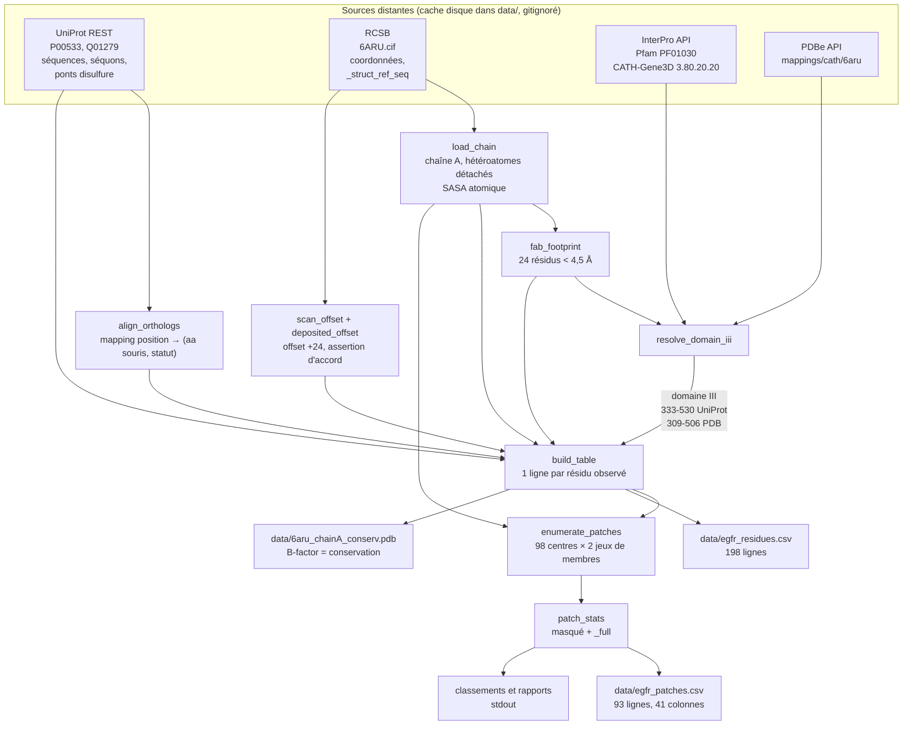
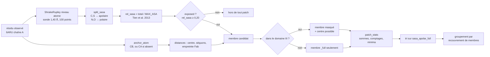

# Architecture — `egfr_epitope_map.py`

Carte d'épitope de l'EGFR humain pour le Challenge 1 Adaptyv × Anthropic. Local, CPU,
coût nul. Le script **ne sélectionne pas** de site : il produit des colonnes et des
distributions.

- Lecture des sorties : [`data/LECTURE.md`](../data/LECTURE.md)
- Journal des décisions, runs et erreurs : [`NOTES.md`](../NOTES.md)
- Contexte et règles du projet : [`CLAUDE.md`](../CLAUDE.md)

Dépendances : biopython 1.88, numpy 2.5.3, Python 3.12.

---

## 1. Flux de données



Le cache est un simple « le fichier existe → ne pas retélécharger ». Un rejeu complet ne
fait aucun appel réseau. Les caches `data/*.json` et `data/*.cif` sont gitignorés
délibérément : ils sont reproductibles depuis la source.

## 2. Chaîne de transformation d'un résidu



Un résidu non exposé ne disparaît pas : il compte dans `n_total`, le dénominateur du taux
d'exposition.

## 3. Fonctions, dans l'ordre d'appel

### Accès aux sources

| fonction | prend | rend | décision portée |
|---|---|---|---|
| `fetch` | url, chemin | chemin local | aucune — cache « existe ou non » |
| `fetch_json` | url, nom | dict ou `None` | **tolère l'absence d'une source** : renvoie `None` au lieu d'échouer, pour que PDBe muet n'arrête pas le script |
| `load_uniprot` | accession | entrée UniProt | aucune |
| `uniprot_features` | entrée, type | liste (desc, début, fin) | ignore les features sans bornes numériques |
| `disulfide_cys` | entrée humaine | positions UniProt | aucune — lit les 25 `Disulfide bond` |

### Bornes de domaine

| fonction | prend | rend | décision portée |
|---|---|---|---|
| `interpro_domains` | base, requête | segments UniProt | aucune |
| `gene3d_superfamily_domains` | — | segments de `G3DSA:3.80.20.20` | **filtre sur la superfamille** par suffixe d'accession |
| `pdbe_cath_domains` | — | segments en numérotation auteur | **ne retient que la chaîne cible** ; renvoie vide sur 6ARU, CATH ne classant que le Fab |
| `pick_domain` | segments, empreinte | un segment | **règle de désignation** : le segment contenant le plus de résidus de l'empreinte du Fab. Géométrique, jamais nominative ni indicielle |
| `resolve_domain_iii` | empreinte, offset | (début, fin) UniProt | **choix de la source : CATH-Gene3D**. Pfam PF01030 déclare omettre ~50 résidus en tête du domaine ; PDBe CATH ne couvre pas la chaîne A. Arrête le script si Gene3D est muet |

### Alignement et structure

| fonction | prend | rend | décision portée |
|---|---|---|---|
| `align_orthologs` | 2 séquences | mapping position → (aa, statut) | **aligne les précurseurs entiers**, puis découpe. Découper d'abord supposerait les bornes des deux côtés. Classe en `identical` / `similar` / `different` |
| `fab_footprint` | modèle | ensemble de numéros PDB | **appelé avant de détacher le Fab**. Double usage : contrôle positif du masque de conservation, et système de désignation du domaine |
| `deposited_offset` | chemin du cif | offset, liste d'écarts | **autorité externe** : lit `_struct_ref_seq`. Arrête si la correspondance n'est pas un décalage unique |
| `scan_offset` | résidus, séquence | offset | inférence par maximisation de concordance ; arrête sous 95 % |
| `load_chain` | séquence humaine | résidus, offset, empreinte, écarts | **assertion d'accord entre les deux routes de numérotation** — arrêt en cas de désaccord. Détache les hétéroatomes **avant** la SASA |
| `report_difs` | écarts, offset, bornes | — | **alerte bruyante** si un écart séquence/structure tombe dans le domaine III : `aa_human` vient de la structure et le statut souris de la séquence UniProt, ces positions seraient incohérentes |
| `cetuximab_control` | empreinte, offset, mapping | — | **contrôle positif inversé** : le cétuximab ne reconnaissant pas l'EGFR murin, son épitope doit sortir **peu** conservé. 70,8 % contre 87,4 % sur le domaine. Une empreinte très conservée signalerait un alignement cassé |

### Table et patches

| fonction | prend | rend | décision portée |
|---|---|---|---|
| `anchor_atom` | résidu | atome | **CB plutôt que CA** : approxime la direction de la chaîne latérale |
| `split_sasa` | résidu | (apolaire, polaire) | **ventilation par élément** : C,S contre N,O |
| `build_table` | résidus, offset, mapping, bornes, empreinte, séquons, cystéines | liste de lignes | arrête si aucun séquon ou aucun résidu d'empreinte n'est observable — refus du repli silencieux sur une distance infinie |
| `patch_stats` | membres | dict d'agrégats | **aucun masque appliqué ici** : appelée deux fois, sur les membres masqués puis complets |
| `enumerate_patches` | lignes, résidus | 98 patches | **centres = résidus exposés du domaine III ; membres = toute la chaîne A**. Produit `n_total`, `frac_exposed`, `n_truncated` |
| `reference_site` | passants du plancher | membres, noms | **désignation du site de référence par les données** : composantes connexes des patches à identité parfaite, la plus grande, étendue à ses satellites |
| `site_report` | patches, plancher, bornes | — | **disjonction en fraction de membres partagés**, jamais en distance entre centres. Clé alignée sur l'ordre des objectifs : ancre acide, puis identité, puis surface |

### Rapports

`size_distribution`, `overlap_distribution`, `dedup_sweep`, `show_ranking`,
`footprint_report`, `density_report`, `truncation_report`, `floor_report`,
`neighbourhood_report`, `cysteine_report`. Aucun ne filtre ; tous impriment.
`write_csv`, `write_bfactor_pdb` écrivent les sorties.

Les 41 colonnes du CSV de patches sont décrites une par une — ce qu'elles mesurent, leur
unité, ce qu'elles ne capturent pas — dans **[`data/LECTURE.md`](../data/LECTURE.md)**. Ce
document-ci décrit le pipeline ; celui-là décrit la sortie.

## 3 bis. Ordre d'exécution de `main()`

Les sections ci-dessus disent ce que fait chaque fonction, pas dans quel ordre la lire.
Les six étapes sont celles que le script imprime (`[1/6]` … `[6/6]`).

**`[1/6]` UniProt**
1. `load_uniprot(HUMAN_AC)`, `load_uniprot(MOUSE_AC)` → les deux entrées, depuis le cache.
2. `uniprot_features(h_entry, "Glycosylation")` filtré sur `N-linked` → 13 séquons.
3. `disulfide_cys(h_entry)` → positions des cystéines pontées, 25 ponts.

**`[2/6]` Alignement**
4. `align_orthologs(seq_h, seq_m)` → `mapping` position humaine → (aa souris, statut).
   Imprime l'identité globale, 90,6 %.

**`[3/6]` Structure**
5. `load_chain(seq_h)`, qui enchaîne lui-même :
   `fetch` du cif → `MMCIFParser` → `fab_footprint(model)` **avant** de détacher le Fab →
   détachement des chaînes non cibles puis des hétéroatomes → `scan_offset` →
   `deposited_offset` → **assertion d'accord entre les deux** → `ShrakeRupley` niveau atome.
   Rend `residues, offset, foot, difs`.

**`[4/6]` Bornes du domaine**
6. `foot_uni` = l'empreinte translatée en numérotation UniProt.
7. `resolve_domain_iii(foot_uni, offset)` → interroge PDBe CATH, Pfam, CATH-Gene3D,
   imprime les trois, applique `pick_domain` à chacune, retient Gene3D. Rend `dom3_uni`.
8. `report_difs(difs, offset, dom3_pdb)` → alerte si un écart tombe dans le domaine.
9. Impression des séquons situés dans le domaine : 5 sur 13.

**`[5/6]` Contrôle**
10. `cetuximab_control(foot, offset, mapping)` → 70,8 % contre 87,4 % sur le domaine.
    **C'est le point de contrôle du pipeline** : il échoue bruyamment si l'alignement ou
    l'offset est cassé, avant toute dépense d'interprétation.

**`[6/6]` Table, patches, rapports**
11. `build_table(...)` → une ligne par résidu observé, 18 colonnes.
12. `enumerate_patches(rows, residues)` → 98 patches, deux jeux de membres chacun.
13. `size_distribution(patches_all)` → distribution des tailles **avant** tout filtre.
14. Filtre `n >= MIN_PATCH_MEMBERS` → 93 patches, puis tri sur `sasa_apolar_full`.
15. `overlap_distribution`, `dedup_sweep` → recouvrements et balayage de seuil.
16. `write_csv` ×2, `write_bfactor_pdb` → les trois sorties sur disque.
17. `show_ranking` ×2 → classement par SASA apolaire absolue, puis par fraction apolaire.
18. `site_report` → sites disjoints. `neighbourhood_report` → calibration du voisinage.
    `floor_report` → plancher 400 Ų. `truncation_report` → effet du masque.
    `footprint_report` → calibration cétuximab. `density_report` → effet de taille.
    `cysteine_report` → part des soufres pontés.

Les étapes 13 et 16 sont volontairement **avant** les classements : les sorties sur disque
ne dépendent d'aucun rapport, et un rapport qui échouerait ne ferait pas perdre les CSV.

---

## 4. Inventaire des constantes et critères binaires

**C'est la partie qui compte.** Tout ce qui, en changeant, changerait la sortie. État des
lieux, sans proposition de correction.

### Le choix de structure — la décision la plus lourde du pipeline

Elle ne ressemble pas à une constante et c'est pour ça qu'elle manquait à cet inventaire.
Tout ce qui suit découle d'un seul choix : **6ARU**.

| propriété | valeur | conséquence |
|---|---|---|
| conformation | **repliée** (tethered) : le bras de dimérisation du domaine II contacte le domaine IV | la SASA inclut l'occlusion par les autres domaines **dans cet état**. Un patch retenu ici est exposé en conformation repliée, pas nécessairement en conformation étendue |
| résolution | **3,20 Å** (`_refine.ls_d_res_high`) | glycanes mal ordonnés : **2 NAG modélisés sur la chaîne A** pour 13 séquons. L'occlusion glycanique n'est pas mesurable, d'où `min_glyc` comme proxy de distance au séquon |
| contenu | Fab de cétuximab (chaînes B, C) lié au **domaine III** | fournit l'empreinte, qui sert à la fois de contrôle positif, de désignateur de domaine, de calibrateur de `FLOOR_APOLAR` et de proxy de surface ligand-compétitive via `dist_fab` |
| chaîne A observée | 1-616 auteur = 25-640 UniProt, 609 résidus | couvre l'ectodomaine entier, domaines I à IV |

**Cette décision a déjà cassé une colonne.** `face` déduisait la face de liaison du ligand
d'un axe centroïde domaine III → centroïde domaine I. En conformation repliée les deux
domaines sont écartés et le site de l'EGF est démonté : les 12 patches recouvrant l'empreinte
du cétuximab sortaient tous en « face externe », alors que cet épitope chevauche le site de
l'EGF. La colonne a été supprimée, remplacée par `dist_fab`.

**Elle justifie aussi de rester borné au domaine III.** Sur une structure repliée, toute
conclusion portant sur une surface éloignée du site dépend d'un état conformationnel qu'on
n'a pas choisi et qu'on ne contrôle pas. La troncature du PDB cible au domaine III est
mesurée sûre pour le site de référence — SASA identique à 0,0 Ų près sur ses 20 résidus
entre chaîne A entière et domaine III isolé, cf. [`prepare_target.py`](../prepare_target.py) —
mais cette mesure vaut **pour ce site, dans cet état**. Elle ne se généralise pas.

**Statut de calibration : non arbitré.** 6ARU est la structure de référence citée par le
règlement. Aucune structure étendue n'a été chargée, aucune comparaison inter-conformation
n'a été faite. C'est la limite la plus profonde du pipeline et elle est non testée.

### Identifiants — non arbitraires

| nom | valeur | origine |
|---|---|---|
| `HUMAN_AC` | `P00533` | [`challenge-01-egfr.md`](../challenge-01-egfr.md) |
| `MOUSE_AC` | `Q01279` | idem |
| `PDB_ID` / `PDB_CHAIN` | `6ARU` / `A` | idem |
| `FAB_CHAINS` | `("B", "C")` | lu dans 6ARU.cif |
| `PFAM_AC` | `PF01030` | accession Pfam « Receptor L domain » |
| `GENE3D_SF` | `3.80.20.20` | superfamille CATH « Receptor L-domain » |

### Seuils géométriques et physiques

| nom | valeur | origine | statut de calibration |
|---|---|---|---|
| `MIN_REL_SASA` | `0.20` | **convention du domaine, fourchette** : l'usage couvre 0,20-0,25 pour l'exposition relative. **Le choix de 0,20 dans cette fourchette est posé**, c'est la borne permissive | **non calibré sur ce projet.** Détermine quels résidus sont membres, donc `n`, toutes les SASA agrégées et le dénominateur `n_total` ; décale tout en aval. 0,25 réduirait mécaniquement le nombre de membres par patch |
| `PATCH_RADIUS` | `11.0` Å | **posé arbitrairement** | **non calibré.** Fixe la taille de l'unité « site ». Détermine aussi le recouvrement entre patches, donc tout le groupement |
| `CONTACT_CUTOFF` | `4.5` Å | **convention du domaine** — contact lourd | non calibré, mais l'empreinte obtenue (24 résidus, 349-473) est cohérente avec un Fab |
| sonde SASA | `1.40` Å, 100 points | **défaut Biopython** `ShrakeRupley` | non touché. Rayon = molécule d'eau |
| `MAX_ASA` | 20 valeurs | **fichier cité** : Tien et al. 2013, valeurs théoriques | publié, pas recalculé ici |
| `APOLAR_ELEMENTS` / `POLAR_ELEMENTS` | `{C,S}` / `{N,O}` | **posé** — ventilation par électronégativité | **équivalence posée** : un carbone de tige de Lys compte comme un carbone de Leu. Les hydrogènes sont absents de la structure (3,20 Å) |

### Seuils de sélection et de classement

| nom | valeur | origine | statut |
|---|---|---|---|
| `MIN_PATCH_MEMBERS` | `6` | **posé** pour un régime d'énumération qui n'existe plus (9 ancres acides) | **obsolète de fait** : ne concerne plus que 5 patches sur 98. La distribution complète est imprimée avant application |
| `FLOOR_APOLAR` | `400.0` Ų | **mesure externe** : médiane 388 Ų des 38 patches recouvrant l'empreinte du cétuximab | **le seul seuil du fichier adossé à une mesure.** Et c'est une référence d'échelle, pas un seuil de suffisance — un Fab enfouit plus qu'un mini-binder |
| `GROUP_LINK` | `0.5` | **posé** | **non calibré.** Définit quand deux patches sont « le même site » |
| `DISJOINT_SWEEP` | `(0.0, 0.1, 0.25)` | **délibérément non fixé** | balayage au lieu d'un seuil. 0,00 et 0,10 donnent les mêmes 3 sites |
| `DEDUP_SWEEP` | 0,1 → 0,9 | **délibérément non fixé** | le balayage ne montre aucune coupure naturelle : continuum de 7 à 26 sites |
| `HYDROPHOBIC` | `LIVFMWY` | **posé** | conservé **uniquement** pour comparaison avec `sasa_apolar`, qui l'a remplacé comme clé |

### Paramètres d'alignement

| paramètre | valeur | origine | statut |
|---|---|---|---|
| matrice | BLOSUM62 | convention | non calibré |
| ouverture de gap | `-11` | **convention** (réglage BLASTP usuel) | non calibré ; le défaut Biopython serait −1 |
| extension de gap | `-1` | idem | idem |
| gaps terminaux | `0.0` | **posé** — les précurseurs entiers n'ont pas à être pénalisés aux bouts | non calibré |
| critère `similar` | `BLOSUM62[a,b] > 0` | **posé** | **non calibré.** N'affecte pas `frac_ident`, qui ne compte que `identical` |
| fenêtre de balayage d'offset | `range(-60, 61)` | **posé** | large devant le peptide signal de 24 résidus |
| fiabilité d'offset | `frac < 0.95` → arrêt | **posé** | la valeur observée est 99,7 % (607/609) |

### Critères binaires et seuils d'alerte

| critère | valeur | rôle | statut |
|---|---|---|---|
| alerte conservation de l'empreinte | `frac >= 0.90` | déclenche l'avertissement « masque de conservation inopérant » | **posé.** Valeur observée 70,8 %, l'alerte ne se déclenche pas |
| identité parfaite | `frac_ident_full >= 1.0` | définit les patches qui amorcent le site de référence | strict par construction |
| voisinage clairsemé | `n_total <= 13` | **reporting uniquement** | **posé puis écarté comme critère** : l'empreinte couvre les deux régimes |
| séquon parmi les membres | `min_glyc == 0.0` | signalement | exact par construction |
| connexité du site de référence | recouvrement `> 0` | composantes connexes des patches parfaits | sans seuil, volontairement |
| clé de tri des sites | `n_acidic_cons` → `frac_ident` → `sasa_apolar` | ordre des objectifs du règlement | **choix documenté**, pas une mesure |

### Ce qui n'est **pas** un paramètre

Les bornes du domaine III (333-530 UniProt) viennent de CATH-Gene3D. L'offset (+24) vient
de `_struct_ref_seq` et du balayage. Les 13 séquons, les 25 ponts disulfure et les deux
conflits de séquence viennent d'UniProt et du mmCIF. Aucune de ces valeurs n'est écrite
dans le script.

---

## 4 bis. Modes d'échec

Le script **s'arrête** plutôt que de se replier silencieusement sur une valeur par défaut.
Huit conditions, toutes des `SystemExit`. Aucune n'est un `try/except` qui avale.

| condition | message émis | cause probable |
|---|---|---|
| CATH-Gene3D ne renvoie aucun segment contenant l'empreinte | *« CATH-Gene3D n'a renvoyé aucun segment contenant l'empreinte du Fab : source retenue indisponible, arrêt plutôt qu'un repli silencieux. »* | API InterPro en panne ou changement de schéma ; ou cache `data/cathgene3d_P00533.json` corrompu. Supprimer le cache et relancer. Un repli sur Pfam serait tentant mais ses bornes sont tronquées de ~50 résidus |
| chaînes du Fab absentes | *« Chaînes ('B', 'C') absentes de 6ARU : empreinte impossible. »* | mauvais `PDB_ID`, ou structure re-déposée avec d'autres identifiants de chaînes. Tout le pipeline en dépend : empreinte, désignation du domaine, `FLOOR_APOLAR`, `dist_fab` |
| empreinte vide malgré les chaînes présentes | *« Empreinte vide : vérifier les identifiants de chaînes. »* | `CONTACT_CUTOFF` trop serré, ou chaînes B/C présentes mais non liées à A dans ce modèle |
| `_struct_ref_seq` donne plusieurs offsets | *« _struct_ref_seq : N offsets distincts … La correspondance n'est pas un décalage unique, le modèle du script ne tient plus. »* | construct avec insertion ou délétion interne : la numérotation n'est plus un décalage constant. Il faudrait un mapping résidu par résidu (SIFTS), pas un scalaire |
| offset peu fiable | *« Offset peu fiable : inspecter la chaîne à la main. »* | concordance `< 0,95` entre séquence structurale et UniProt. Mauvaise accession, mauvaise chaîne, ou beaucoup de mutations. Valeur observée : 99,7 % |
| **désaccord entre les deux routes de numérotation** | *« DÉSACCORD de numérotation : balayage ±N vs _struct_ref_seq ±M. Deux routes indépendantes divergent, aucune n'est fiable sans inspection manuelle. »* | le cas le plus instructif : l'inférence et la déclaration du déposant se contredisent. Ne jamais arbitrer automatiquement |
| aucun séquon sur un résidu observé | *« Aucun site de N-glycosylation ne tombe sur un résidu observé … arrêt plutôt qu'un repli silencieux sur une distance infinie. »* | annotations UniProt hors de la fenêtre observée, ou offset faux. Sans ce garde-fou, `min_glyc` vaudrait l'infini partout et **tous** les patches passeraient |
| aucun résidu d'empreinte observé | *« Aucun résidu de l'empreinte du Fab ne tombe sur un résidu observé : la colonne dist_fab serait inopérante. »* | même famille. `dist_fab` deviendrait silencieusement vide |

Les deux dernières partagent un motif qui vaut d'être nommé : **une distance dont le
référentiel est vide ne vaut pas l'infini, elle ne vaut rien.** Un filtre adossé dessus
laisserait tout passer en paraissant fonctionner. C'est la même famille d'erreur que la
pénalité glycane du §5, qui annulait 22 patches sans trace.

Alertes qui **n'arrêtent pas** le script mais exigent une lecture : empreinte conservée à
≥ 90 % (masque de conservation possiblement inopérant), écart `_struct_ref_seq_dif` tombant
dans le domaine III (table incohérente à ces positions), et source PDBe muette — celle-ci
est tolérée par construction, `fetch_json` renvoyant `None`.

---

## 5. Trois erreurs trouvées par la mesure

### `Repeat` UniProt inutilisable comme borne de domaine

P00533 n'a **qu'une** feature `Domain` : la kinase, 712-979. Aucun « Receptor L-domain ».
Les L-domaines n'existent que comme `Repeat` marquées « Approximate » : 75-300 et 390-600.
La seconde vaut 366-576 en numérotation mature, décalée d'une cinquantaine de résidus du
domaine III structural. Le script échouait dessus. Remplacée d'abord par un rayon de 30 Å
autour du centroïde de l'empreinte — qui donnait 335-535, à 2-5 résidus de la vraie borne —
puis par CATH-Gene3D. **La fausse borne a été détectée en comparant deux sources, pas en
relisant le code.**

### Funnel effondré sur une tautologie d'échantillonnage

`rank_patches` itérait sur les ancres acides conservées et exposées pour produire les
centres, puis ramassait les membres. « Être centré sur un Asp/Glu conservé » n'était donc
pas un critère appliqué à un échantillon de sites : c'était la **définition** du site. Le
funnel tombait à 1 site, et la conclusion « 0 hydrophobe sur les 8 patches » ne mesurait
rien d'autre que le fait qu'un disque centré sur un résidu chargé est polaire.

Après passage à 98 centres — tous les résidus exposés du domaine III — **64 patches sur 93
portent une ancre acide conservée** et 15 combinent `apolar_frac ≥ 0,55` avec au moins une
ancre. L'incompatibilité « ancrage acide contre designabilité », posée comme hypothèse
structurale, n'existait pas dans les données.

### Pénalité glycane annulant 22 patches sans ligne de journal

Le filtre dur `dist_glycan > 12 Å` écartait 7 patches sur 9 dans l'ancien régime. Remplacé
par une pénalité continue `clamp(min_glyc / 12, 0, 1)` multipliant la SASA apolaire. Mesure
faite avant de s'en servir : la pénalité vaut **exactement 0** à `min_glyc = 0`, donc elle
**annulait 22 patches sur 93** — le filtre dur, mais sans trace. Et 77 sur 93 étaient
pénalisés, avec des écarts de rang jusqu'à −33. Sa pente imposait de surcroît un taux de
change jamais choisi : 1 Å de distance au séquon contre 1/12 de la SASA apolaire, soit 50 Ų
sur un patch à 600 Ų.

Retirée. `min_glyc` est une colonne brute en Å, lue à la main sur la liste courte.

---

## 6. Rejouer

```bash
uv venv --python 3.12 && source .venv/bin/activate
uv pip install -r pyproject.toml
python egfr_epitope_map.py
```

Premier appel : ~2 Mo téléchargés dans `data/`. Rejeux : aucun réseau. Durée de l'ordre de
la dizaine de secondes sur CPU. Aucun GPU, aucun modèle.
